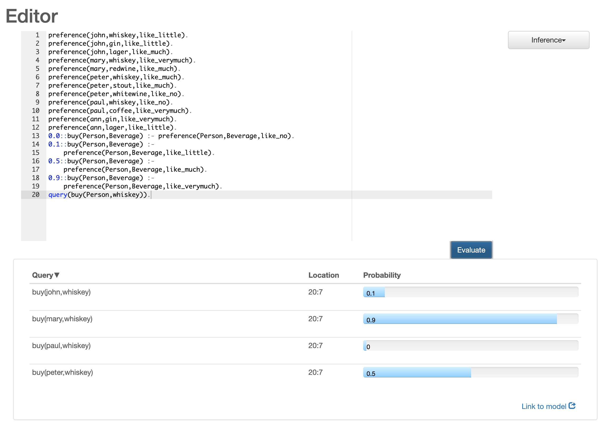

# Prolog And Derivatives

This repository is used for a story about Prolog and derivatives such as Golog and ProbLog on [Medium](https://medium.com/axons/essential-kubernetes-tools-94503209d1cb).

It contains Prolog, Golog and ProbLog examples.

## Prolog
```bash
brew install swipl
```
```bash
[15/12/19 2:22:54] ➜  prolog git:(master) ✗ swipl
Welcome to SWI-Prolog (threaded, 64 bits, version 8.0.3)
SWI-Prolog comes with ABSOLUTELY NO WARRANTY. This is free software.
Please run ?- license. for legal details.

For online help and background, visit http://www.swi-prolog.org
For built-in help, use ?- help(Topic). or ?- apropos(Word).

?- [boolean].
true.

?- eval(and(or(not(true),true),false),X).
X = false .
```

## Golog
Golog can be run by using ECLiPSe and can be downloaded [here](https://eclipseclp.org/Distribution/CurrentRelease/).

```bash
[15/12/19 2:25:56] ➜  golog git:(master) ✗ eclipse
ECLiPSe Constraint Logic Programming System [kernel]
Kernel and basic libraries copyright Cisco Systems, Inc.
and subject to the Cisco-style Mozilla Public Licence 1.1
(see legal/cmpl.txt or http://eclipseclp.org/licence)
Source available at www.sourceforge.org/projects/eclipse-clp
GMP library copyright Free Software Foundation, see legal/lgpl.txt
For other libraries see their individual copyright notices
Version 6.1 #164 (x86_64_macosx), Mon Jul 15 23:37 2013
[eclipse 1]: [robot].
source_processor.eco loaded in 0.01 seconds
hash.eco   loaded in 0.00 seconds
compiler_common.eco loaded in 0.01 seconds
compiler_normalise.eco loaded in 0.00 seconds
compiler_map.eco loaded in 0.00 seconds
compiler_analysis.eco loaded in 0.00 seconds
compiler_peephole.eco loaded in 0.00 seconds
compiler_codegen.eco loaded in 0.01 seconds
compiler_varclass.eco loaded in 0.00 seconds
compiler_indexing.eco loaded in 0.00 seconds
compiler_regassign.eco loaded in 0.01 seconds
asm.eco    loaded in 0.00 seconds
module_options.eco loaded in 0.01 seconds
ecl_compiler.eco loaded in 0.05 seconds
*** Loading kplanner by Hector Levesque (c) 2004, version 1.0
*** Loading ktrue by Hector Levesque (c) 2004, version 1.0
robot.pl   compiled 66616 bytes in 0.05 seconds

Yes (0.10s cpu)
[eclipse 2]: top.
The goal:  finished = yes

 0 1 2 3 4xx

A plan is found after 0.00999999999999998 seconds.
-------------------------------------------
LOOP
  CASE senseSandLayer OF
     -noSandLayer: 
         CASE senseIceLayer OF
            -noIceLayer: EXIT
            -iceLayer: 
                removeIceLayer ;
                NEXT
         ENDC
     -sandLayer: 
         removeSandLayer ;
         NEXT
  ENDC
ENDL ;
putAwayMineral


Yes (0.01s cpu, solution 1, maybe more) ? 
```

## ProbLog
Examples can be run by the interactive editor [here](https://dtai.cs.kuleuven.be/problog/editor.html).

